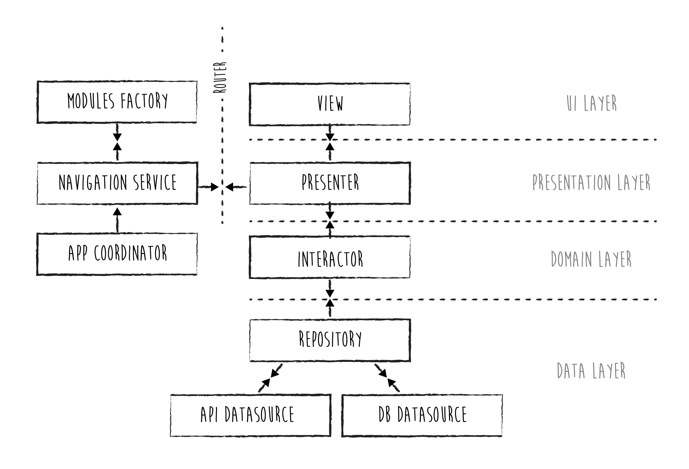

# StackOverflowUsers
## Installation

- Check out **develop** branch and run **pod install**. 
- Please note that Cocoapod is not used to install external dependencies but a **SharedComponents** framework that I used to encapsulate  the api & network service along with other utilities. These classes are tested in the framework Demo app. 
 

 ## Architecture
 
 The app implements a **Viper** architecture, with a "twist": the Router service is performed by a **FlowCoordinator** (Navigation Coordinator pattern).

## Domains and data binding
 
 - At the lowest level, the **Data Domain** is designed around different **data sources** (API, FollowedUserDatabase, BlockedUserDatabase) using their specific models. A **Repository** (data layer facade) constitutes the boundary between the Data and the Logic layer, providing a single  **DomainModel** type ("User") to the Logic layer of the app.
 - In the  **Logic domain** the **Interactor** performs operations on the Domain Models (follow/unfollow/block/fetch) and provide them to the Presentation layer.
 - Domain models are then used by the **Presentation layer** (**Presenter**) in order to generate view-specific types **ViewModel** to be consumed by the UI layer.
 
 ## Data flows
 
 The data flows are arranged according to the above. 
 User actions that impact on data are propagated from the ui layer,  through presentation and logic layer down to the data layer. From there, the modified data is propagated back up to the ui.
 Actions that don't effect the data but only the presentation (e.g. disclosing a section of a cell) are  propagated from the ui to the presentation layer and from there back to the ui.
